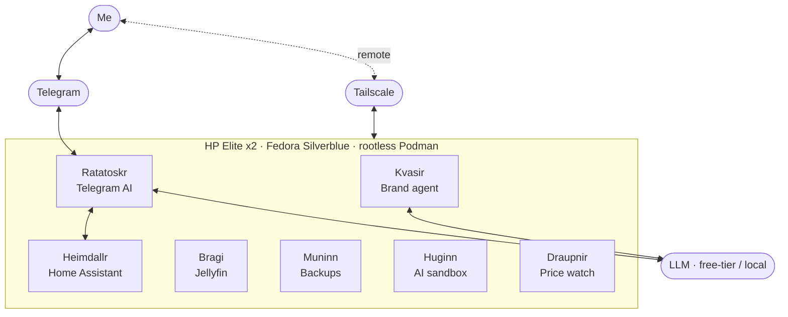

# ᛉ Yggdrasil

**A self-hosted home infrastructure that reads like a saga** — a repurposed 2-in-1 tablet turned into an immutable, reproducible, AI-tended home server.

## The idea

**Yggdrasil** is the world-tree that holds my home together: home automation, media,
backups, and a small court of AI agents — all running on a single repurposed
**HP Elite x2** under **Fedora Silverblue**, an immutable, image-based OS.

Every service is a **rootless Podman** container. Every dotfile and config lives in
a **bare git repository** that can **bootstrap the whole machine from zero with one
command**. The day-to-day is driven through a **single Telegram channel** by an
agentic AI. And the naming is Norse — each service is a being from the myth, chosen
for what it does.

## The realms

| Realm | Role | Stack |
|---|---|---|
| **Heimdallr** | The watchman — home automation & dashboards | Home Assistant |
| **Bragi** | The bard — personal media library | Jellyfin |
| **Muninn** | Memory — automated encrypted backups | BorgBackup |
| **Ratatoskr** | The messenger — agentic AI over Telegram (text + voice) | Python · LLM · Whisper |
| **Kvasir** | The counselor — keeps my professional presence coherent | Python · LLM |
| **Huginn** | Thought — a sandboxed AI coding agent, one home per identity | Podman · Playwright |
| **Draupnir** | The ring that drips gold — a price watcher | Python |

## Architecture

## Principles

- **Immutable base** — Fedora Silverblue / `rpm-ostree`: the OS is an image.
  Experiments never rot the system, and updates roll back cleanly.
- **Rootless & isolated** — every service is a rootless Podman container; the AI
  coding agent runs in a sandbox that sees only the directory it is handed.
- **Reproducible** — a bare git dotfiles repo plus a bootstrap script rebuild the
  whole machine from a fresh install. Secrets never live in git.
- **One channel** — control and notifications converge on a single Telegram bot
  instead of a dozen apps.
- **Free / local-first AI** — the agents run on a free-tier model today and are
  built to swap to a fully local model (Ollama) tomorrow; secrets never reach the
  model.
- **Named like a saga** — because infrastructure you enjoy is infrastructure you
  keep maintaining.

## Reproducibility & secrets

The live configuration lives in a **private** repository and is intentionally not
public. This repository is the **architecture and the story**, kept clean of
secrets and machine-specific state. Credentials are stored outside git, with strict
permissions, and are never passed on a command line.

## License

[MIT](LICENSE) © Ivan Del Fatti
